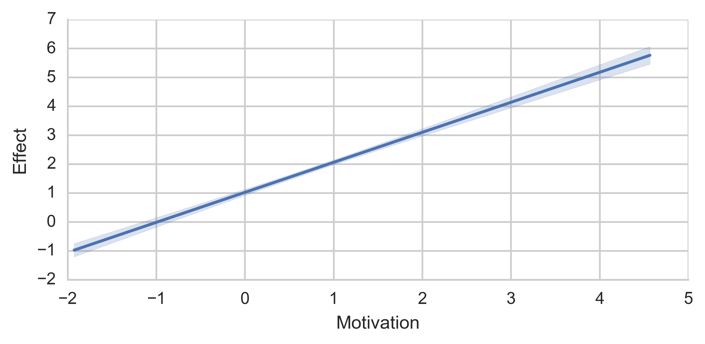
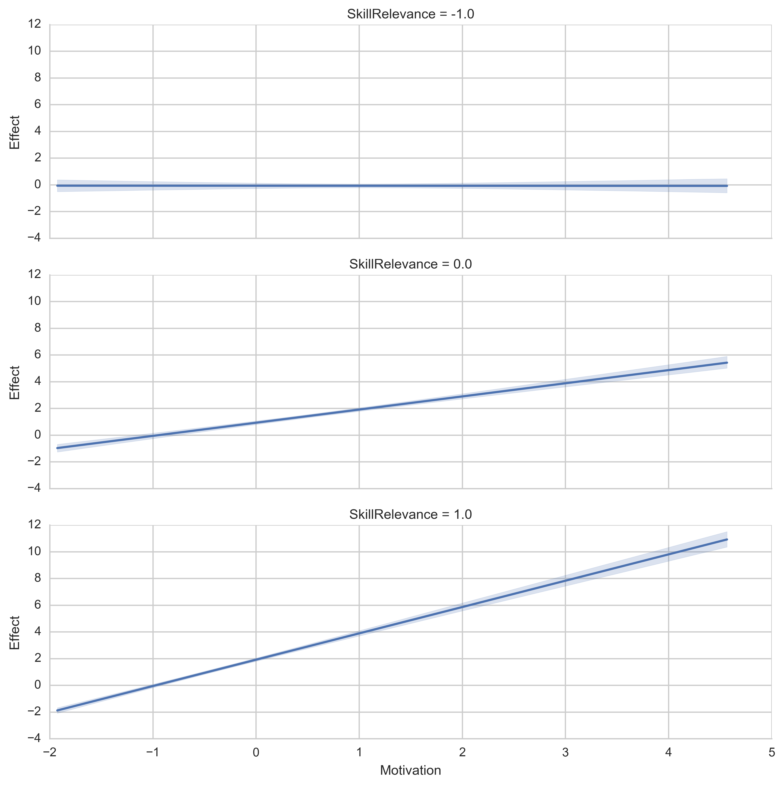
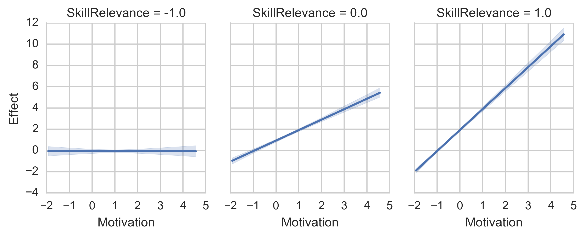
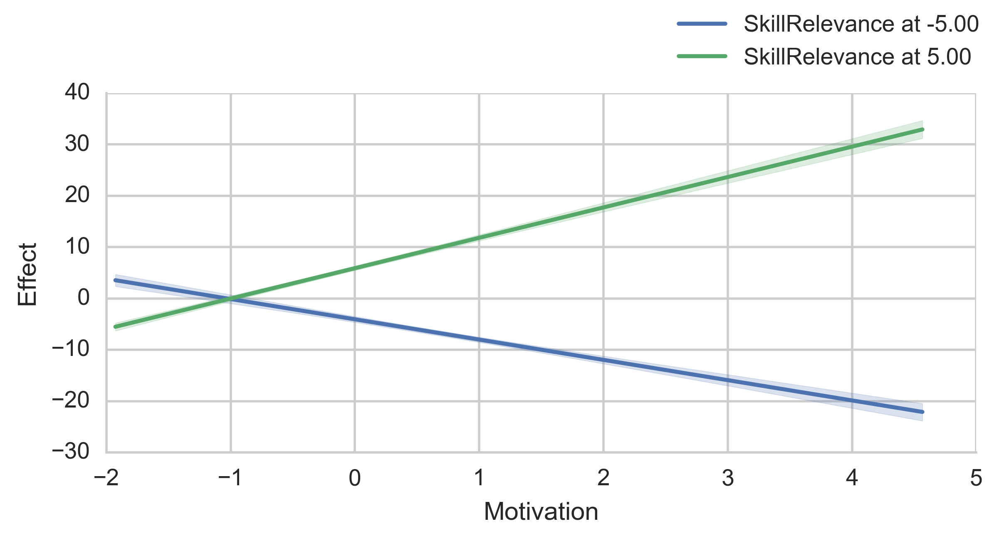
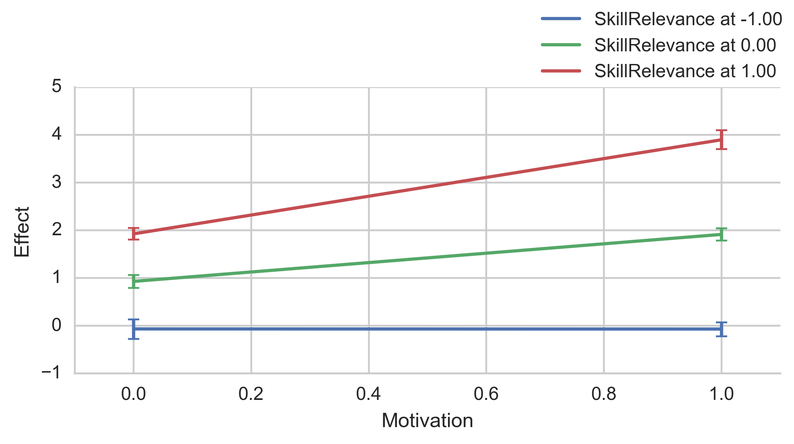
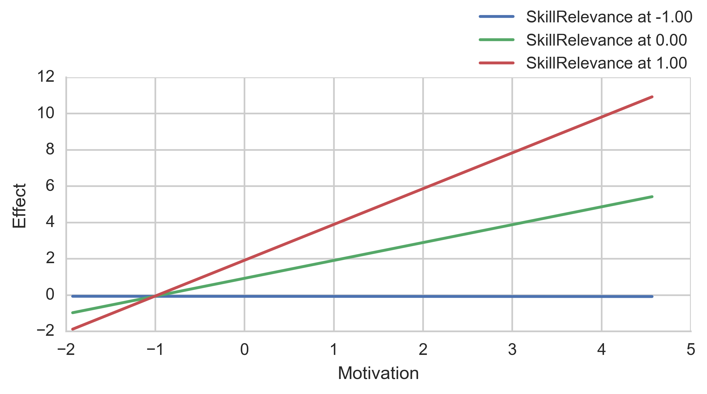
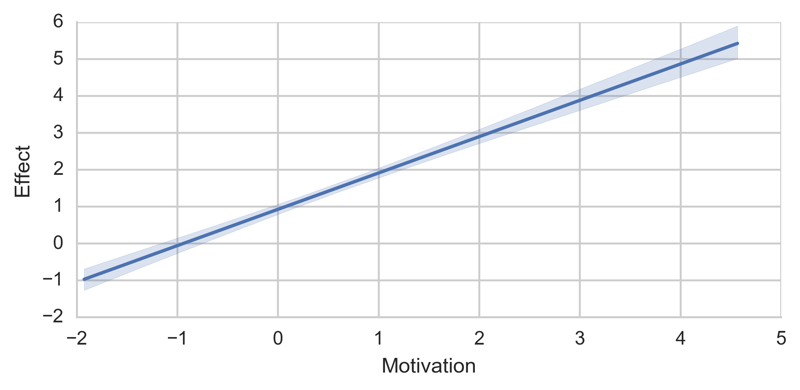
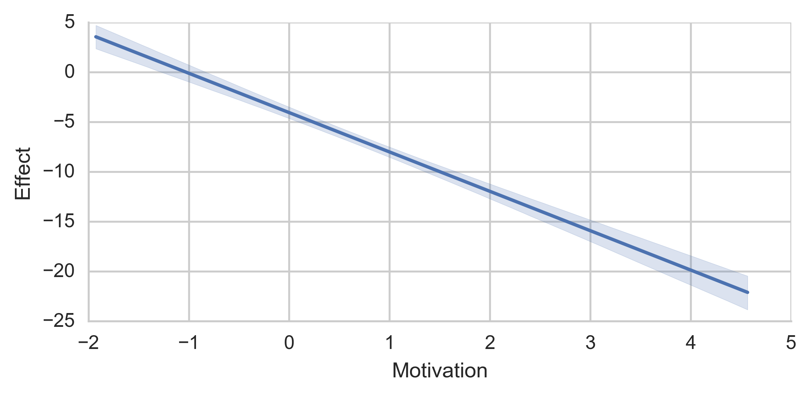

PyProcessMacro: A Python Implementation of Andrew F. Hayes' 'Process' Macro
============================================================================

# Copyright Notice for the original Process Macro

The Process Macro for SAS and SPSS, and its associated files, are copyrighted by Andrew F. Hayes. The original code
must not be edited or modified, and must not be distributed outside of 
[http://www.processmacro.org](http://www.processmacro.org).
 
Because PyProcessMacro is a complete reimplementation of the Process Macro, and was not based on the original 
code, permission was generously granted by Andrew F. Hayes to distribute PyProcessMacro under a MIT license.
 
This permission is not an endorsement of PyProcessMacro: all potential errors, bugs and inaccuracies are my own, and
Andrew F. Hayes was not involved in writing, reviewing, or debugging the code.

# Manifest

The Process Macro by Andrew F. Hayes has helped thousands of researchers in their analysis of moderation, mediation, and
conditional processes. Unfortunately, Process was only available for proprietary softwares (SAS and SPSS), which means
that students and researchers had to purchase a license of those softwares to make use of the Macro.

Because of the growing popularity of Python in the scientific community, I decided to implement the features of the 
Process Macro into an open-source library, that researchers will be able to use without relying on those proprietary
softwaress. PyProcessMacro is released under a MIT license.
 
# Features

In the current version, PyProcessMacro replicates the following features from the original Process Macro v2.16:
  * All models (1 to 76), with the exception of Model 6 (serial mediation) are supported, and have been numerically
  tested for accuracy against the output of the original Process macro (see the `test_models_accuracy.py`)
  * Estimation of binary/continuous outcome variables. The binary outcomes are estimated in Logit using the 
  Newton-Raphson convergence algorithm, the continuous variables are estimated using OLS.
  * All statistics reported by Process: 
    * Variable parameters for outcome models
    * (Conditional) direct and indirect effects
    * Indices for Partial/Conditional/Moderated Moderated Mediation are always reported if the model supports them.
  * Automatic generation of spotlight values for continuous/discrete moderators.
  * Rich set of options to tweak the estimation and display of the different models: (almost) all the options from
  Process exist in PyProcessMacro. Check the doc for more details.

The following changes and improvements have been made from the original Process Macro:
  * Variable names can be of any length, and even include spaces and special characters.
  * All mediation models support an infinite number of mediators (versus a maximum of 10 in Process).
  * Normal theory tests for the indirect effect(s) are not reported, as the bootstrapping approach is now widely
  accepted and in most cases more robust.
  * Plotting capabilities: PyProcessMacro can generate the plot of conditional direct and indirect effects at various 
  levels of the moderators. See the documentation for plot_conditional_indirect_effects() and 
  plot_conditional_direct_effects().
  * Fast estimation process: PyProcessMacro leverages the capabilities of NumPy to efficiently compute a large number
  of bootstrap estimates, and dramatically speed up the estimation of complex models.
  * Transparent bootstrapping: PyProcessMacro explicitely reports the number of bootstrap samples that have been 
  discarded because of numerical instability.

In the current version, the following features have not yet been ported to PyProcessMacro:
  * Support for categorical independent variables.
  * Generation of individual fixed effects for repeated measures.
  * R² improvement from moderators in moderation models (1, 2, 3).
  * Estimation of serial mediation (Model 6)
  * Some options (`normal`, `varorder`, ...). PyProcessMacro will issue a warning to tell you if an option you are 
  trying to use is not implemented.

# Version History

## Master Versions

### 1.0.4
**Bug fix for standard error estimate in all models**
PyProcessMacro was, by default, using the HC3 estimator for the variance-covariance matrix instead of the HC0 estimator. 
This has now been changed. To continue using the HC3 estimator, specify `hc3=True` when initializing the Process instance. 
Thanks to Zoé Ziani for the bug report.

### 1.0.3
**Bug fix for Models 58 and 59**
The number of moderators was not properly computed, and pyprocessmacro was crashing on those two models. It has now 
been fixed. Thanks to amrain-py for the bug report.

### 1.0.2
**Bug fix in the Index of Moderated Moderated Mediation**
In the summary, the Index of Moderated Moderated Mediation was reported as a zero-width confidence interval.

### 1.0.0 
**Added support for floodlight analysis (Johnson-Neyman region of significance).**

The methods `floodlight_direct_effect()` and `floodlight_indirect_effect()` can now be used to find the range of values
at which an effect is significant. See the documentation for more information on those methods.

**Added methods: `spotlight_direct_effect()` and `spotlight_direct_effect()`.**

Those methods can be used to compute the conditional (in)direct effects of the models at various levels of the 
moderators. 

**Deprecation of `plot_direct_effects()` and `plot_indirect_effects()`.**

Those methods have been deprecated in favor of `plot_conditional_direct_effects()` and 
`plot_conditional_indirect_effects()` respectively. 

The signature of the function has also changed: the argument `mods_at` has been renamed `modval` for consistency with
other functions. Under the hood, those functions are faster and are using the newly introduced 
`spotlight_direct_effect()` and `spotlight_direct_effect()` methods.

## Beta versions

### 0.9.6 -> 0.9.7

* Added support for Moderation Mediation Index in single moderator models.
* Performance improvements
* Dependency updates
* Added tests

### 0.9.1 -> 0.9.5
* Various bugfixes 
* Performance improvements

### 0.9.0
First beta release.

# Installation and Documentation

This section will familiarize you with the few differences that exist between Process and PyProcessMacro.

You can install PyProcessMacro with pip:

    pip install pyprocessmacro

## 1. Initializing a Process object

### A. Minimal example

The basic syntax for PyProcessMacro is the following:

````python
from pyprocessmacro import Process
import pandas as pd
df = pd.read_csv("MyDataset.csv")
p = Process(data=df, model=13, x="Effort", y="Success", w="Motivation", z="SkillRelevance", 
            m=["MediationSkills", "ModerationSkills"])
p.summary()
````

[Click to see a sample output!](SampleOutput.md)

As you can see, the syntax for PyProcessMacro is (almost) identical to that of Process. Unless this documentation
 mentions otherwise, you can assume that all the options/keywords from Process exist in PyProcessMacro.
 
 A `Process` object is initialized by specifying a data source, the model number, and the mapping between the symbols 
 and the variable names. 

Once the object is initialized, you can call its `summary()` method to display the estimation results

You might have noticed that there is no argument `varlist` in PyProcessMacro. This is because the list of variables 
is automatically inferred from the variable names given to x, y, m.

### B. Adding statistical controls

In Process, the controls are defined as "any argument in the varlist that is not the IV, the DV, a moderator, or 
a mediator." In PyProcessMacro, the list of variables to include as controls have to be explicitely specified in 
the "controls" argument.

The equation(s) to which the controls are added is specified through the `controls_in` argument:
  * `x_to_m` means that the controls will be added in the path from the IV to the mediator(s) only.
  * `all_to_y` means that the controls will be added in the path from the IV and the mediators to the DV only. 
  * `all` means that the controls will be added in all equations.
  
The ability to specify a different list of control for each equation is coming in the next release of PyProcessMacro.
  
````python
p = Process(data=df, model=13, x="Effort", y="Success", w="Motivation", z="SkillRelevance", 
            m=["MediationSkills", "ModerationSkills"],
            controls=["Control1", "Control2"],
            controls_in="all")
p.summary()
````

### C. Logistic regression for binary outcomes

The original Process Macro automatically uses a Logistic (instead of OLS) regression when it detects a binary outcome.
 
PyProcessMacro prefers a more explicit approach, and requires you to set the parameter `logit` to `True` if your DV
should be estimated using a Logistic regression.

````python
p = Process(data=df, model=13, x="Effort", y="Success", w="Motivation", z="SkillRelevance", 
            m=["MediationSkills", "ModerationSkills"], logit=True)
p.summary()
````

It goes without saying that this will return an error if your DV is not dichotomous.

### D. Specifying custom spotlight values for the moderator(s)

In Process as in PyProcessMacro the spotlight values of the moderators are defined as follow:
* By default, the spotlight values are equal to M - 1SD, M and M + 1SD, where M and SD are the mean and standard 
deviation of that variable. If the option `quantile=1` is specified, then the spotlight values for each moderator 
are the 10th, 25th, 50th, 75th and 90th percentile of that variable.
* If a moderator is a discrete variable, the spotlight values are those discrete values.

In Process, custom spotlight values can be applied to each moderator q, v, z, ... through the arguments qmodval, 
vmodval, zmodval... 

In PyProcessMacro, the user must instead supply custom values for each moderator in a dictionary
passed to the `modval` parameter:

````python
p = Process(data=df, model=13, x="Effort", y="Success", w="Motivation", z="SkillRelevance", 
            m=["MediationSkills", "ModerationSkills"],
            modval={
                "Motivation":[-5, 0, 5], # Moderator 'Motivation' at values -5, 0 and 5
                "SkillRelevance":[-1, 1] # Moderator 'SkillRelevance' at values -1 and 1
            })
p.summary()
````

### E. Suppress the initialization information

When the Process object is initialized by Python, it displays various information about the model (model number, list of
 variables, sample size, number of bootstrap samples, etc...). If you wish not to display this information, just add the
 argument `suppr_init=True` when initializing the model.
 
````python
p = Process(data=df, model=13, x="Effort", y="Success", w="Motivation", z="SkillRelevance", 
            m=["MediationSkills", "ModerationSkills"], suppr_init=True)
p.summary()
````

## 2. Accessing the estimation results

After the `Process` object is initialized, you are not limited to printing the summary. PyProcessMacro implements the
following methods that allow you to conveniently recover the different estimates of interest:

### A. `summary()`

This method replicates the output that you would see in Process, and displays the following information:
* Model summaries and parameters estimates for all outcomes (i.e. the independent variable, and the mediator(s)).
* If the model has a moderation, conditional effects at the spotlight values of the moderator(s).
* If the model has a mediation, direct and indirect effects.
* If the model has a moderation and a mediation, conditional direct and indirect effects at values of the moderator(s).
* If those statistics are relevant, indices for partial, conditional, and moderated moderated mediation will be 
reported.

### B. `outcome_models`

This command gives you individual access to each of the outcome models through a dictionary. This allows you to recover 
the model and parameters estimates for each outcome.

Each OutcomeModel object has the following methods:
* `summary()` prints the full summary of the model (as Process does).
* `model_summary()` returns a DataFrame of goodness-of-fit statistics for the model. 
* `coeff_summary()`  returns a DataFrame of estimate, standard error,  corresponding z/t, p-value, and
 confidence interval for each of the parameters in the model.
* `estimation_results` gives you access to a dictionary containing all the statistical information of the
 model.
 
````python
p = Process(data=df, model=13, x="Effort", y="Success", w="Motivation", z="SkillRelevance", 
            m=["MediationSkills", "ModerationSkills"], suppr_init=True)

model_medskills = p.outcome_models["MediationSkills"] # The model for the outcome "MediationSkills"

model_medskills.summary() # Print the summary for this model

df_params_med1 = model_medskills.coeff_summary() # Store the DataFrame of estimates into a variable.

med1_R2 = model_medskills.estimation_results["R2"] # Store the R² of the model into a variable.
````

Note that the methods are called from the `model_medskills` object! If you call `p.coeff_summary()`, 
you will get an error.

### C. `direct_model`

When the Process model includes a mediation, the direct effect model can conveniently be accessed, which 
gives you access to the following methods: 

* `summary()` prints the full summary of the direct effects, as done in calling Process.summary().
* `coeff_summary()` returns a DataFrame of estimate, standard error, t-value, p-value, and confidence 
interval for each of the (conditional) direct effect(s).

````python
p = Process(data=df, model=13, x="Effort", y="Success", w="Motivation", z="SkillRelevance", 
            m=["MediationSkills", "ModerationSkills"], suppr_init=True)

direct_model = p.direct_model # The model for the direct effect

df_params_direct = direct_model.coeff_summary() # Store the DataFrame of estimates into a variable.
````

Note that the methods are called from the `direct_model` object! If you call `p.coeff_summary()`, you will get an 
error.


### D. `indirect_model`

When the Process model includes a parallel mediation, the indirect effect model can be accessed as well, which 
gives you access to the following methods: 

* `summary()` prints the full summary of the indirect effects, and other related indices, as done in
 calling Process.summary().
* `coeff_summary()` returns a DataFrame of indirect effect(s) and their SE/CI for each of the mediation
paths
* `PMM_index_summary()` returns a DataFrame of indices for Partial Moderated Mediation, and their 
SE/CI, for each of the moderators and mediation paths. If the model does not compute a PMM, this will return an error.
* `CMM_index_summary()` returns a DataFrame of indices for Conditional Moderated Mediation, and their 
SE/CI, for each of the moderators and mediation paths. If the model does not compute a CMM, this will return an error.
* `CMM_index_summary()` returns a DataFrame of indices for Moderated Moderated Mediation, and their 
SE/CI, for each of the mediation paths. If the model does not compute a MMM, this will return an error.

````python
p = Process(data=df, model=13, x="Effort", y="Success", w="Motivation", z="SkillRelevance", 
            m=["MediationSkills", "ModerationSkills"], suppr_init=True)

indirect_model = p.indirect_model # The model for the direct effect

df_params_direct = indirect_model.coeff_summary() # Store the DataFrame of estimates into a variable.
````

Note that the methods are called from the `indirect_model` object! If you call `p.coeff_summary()`, you will get an 
error.


## 3. Spotlight and Floodlight Analysis 

### A. Compute direct/indirect effects for specific values (spotlight analysis)

If you wish to display the conditional effects at other values of the moderator(s), you do not have to re-instantiate 
the model from scratch, and can instead use the `spotlight_direct_effect()` and 
`spotlight_indirect_effect()` methods.

````python
df_direct_effects = p.spotlight_direct_effect(modval={
                                    "Motivation":[-1, 0, 1], # Moderator 'Motivation' at values -1, 0 and 1
                                    "SkillRelevance":[-5, 5] # Moderator 'SkillRelevance' at values -1 and 1
            })

df_indirect_effects = p.spotlight_indirect_effect(med_name="MediationSkills", modval={
                                    "Motivation":[-1, 0, 1], # Moderator 'Motivation' at values -1, 0 and 1
                                    "SkillRelevance":[-5, 5] # Moderator 'SkillRelevance' at values -1 and 1
            })
````

### B. Find the values of a moderator for which the direct/indirect effect are significant (floodlight analysis)

Instead of checking the direct and indirect effects at specific values, you might be interested in identifying under
which level of a moderator the effect becomes significant. 

````python
floodlight_motiv_direct= p.floodlight_direct_effect(mod_name="Motivation")
floodlight_motiv_indirect = p.spotlight_indirect_effect(med_name="MediationSkills", mod_name="Motivation")
````

Calling `floodlight_motiv_direct` or `floodlight_motiv_indirect` will print out a detailed summary of the region(s) of 
significance. Alternatively, you can call `floodlight_motiv_direct.get_significance_regions()` to get the regions of
positive/negative significance in a dictionary.

The floodlight analysis can only be conducted on one moderator at a time. When multiple moderators are present on the
direct/indirect path, the floodlight analysis assumes the value of those other moderators to be zero. However, you can
change this behavior by specifying a custom level for the other moderators:

````python
floodlight_motiv_direct= p.floodlight_direct_effect(mod_name="Motivation", other_modval={"SkillRelevance": 1})
floodlight_motiv_indirect = p.spotlight_indirect_effect(med_name="MediationSkills", mod_name="Motivation",
                                                        other_modval={"SkillRelevance": 1})
````

Here, pyprocessmacro will conduct a floodlight analysis on the effect of MediationSkills when the level of 
SkillRelevance is set to 1. This is, in essence, a spotlight-floodlight analysis ;).


## 4. Recover bootstrap samples estimates

The original Process macro allows you to save the parameter estimates for each bootstrap sample by specifying the `save`
keyword. The Macro then returns a new dataset of bootstrap estimates.

In PyProcessMacro, this is done by calling the method `get_bootstrap_estimates()`, which returns a DataFrame containing 
the parameters estimates for all variables in the model, for each outcome.

````python
p = Process(data=df, model=13, x="Effort", y="Success", w="Motivation", z="SkillRelevance", 
            m=["MediationSkills", "ModerationSkills"], suppr_init=True)

boot_estimates = p.get_bootstrap_estimates() # Called from the Process object directly.
````

## 5. Plotting capabilities

PyProcessMacro allows you to plot the conditional direct and indirect effect(s), at different values of the moderators.

The methods `plot_conditional_indirect_effects()` and `plot_conditional_direct_effects()` are identical in syntax, 
with one small exception: you must specify the name of the mediator for `plot_indirect_effects` as a first argument. 
They return a `seaborn.FacetGrid` object that can be used to further tweak the appearance of the plot.

### A. Basic Usage 

When plotting conditional direct (and indirect) effects, the effect is always represented on the y-axis. 

The various spotlight values of the moderator(s) can be represented on several dimensions:
* On the x-axis (moderator passed to `x`).
* As a color-code, in which case several lines are displayed on the same plot (moderator passed to `hue`).
* On different plots, displayed side-by-side (moderator passed to `col`).
* On different plots, displayed one below the other (moderator passed to `row`)

At the minimum, the `x` argument is required, while the `hue`, `col` and `row` are optional.
The examples below are showing what the plots could look like for a model with two moderators.

````python
from pyprocessmacro import Process
import pandas as pd
import matplotlib.pyplot as plt

df = pd.read_csv("MyDataset.csv")
p = Process(data=df, model=13, x="Effort", y="Success", w="Motivation", z="SkillRelevance", 
            m=["MediationSkills", "ModerationSkills"], suppr_init=True)

# Conditional direct effects of Effort, at values of Motivation (x-axis) 
g = p.plot_direct_effects(x="Motivation") 
plt.show()
````


````python
# Conditional indirect effects through MediationSkills, at values of Motivation (x-axis) and 
# SkillRelevance (color-coded)
g = p.plot_indirect_effects(med_name="MediationSkills", x="Motivation", hue="SkillRelevance") 
g.add_legend(title="") # Add the legend for the color-coding
plt.show()
````

````python
# Display the values for SkillRelevance on side-by-side plots instead.
g = p.plot_indirect_effects(med_name="MediationSkills", x="Motivation", col="SkillRelevance")
plt.show()
````

````python
# Display the values for SkillRelevance on vertical plots instead.
g = p.plot_indirect_effects(med_name="MediationSkills", x="Motivation", row="SkillRelevance")
plt.show()
````

### B. Change the spotlight values

By default, the spotlight values used to plot the effects are the same as the ones passed when initializing Process.
However, you can pass custom values for some, or all, the moderators through the `modval` argument.

````python
# Change the spotlight values for SkillRelevance
g = p.plot_indirect_effects(med_name="MediationSkills", x="Motivation", hue="SkillRelevance", 
                            modval={"SkillRelevance": [-5, 5]})
g.add_legend(title="")
plt.show()
````


### C. Representation of uncertainty

The display of confidence intervals for the direct/indirect effects can be customized through the `errstyle` argument:
* `errstyle="band"` (default) plots a continuous error band between the lower and higher confidence interval. This 
representation works well when the moderator displayed on the x-axis is continuous (e.g. age), as it allows you to 
visualize the error at all levels of the moderator.
* `errstyle="ci"` plots an error bar at each value of the moderator on x-axis. It works well when the moderator 
 displayed on the x-axis is dichotomous or has few values (e.g. gender), as it reduces clutter.
* `errstyle="none"` does not show the error on the plot.
 
 ````python
# CI for dichotomous moderator
g = p.plot_indirect_effects(med_name="MediationSkills", x="Motivation", hue="SkillRelevance", 
                            modval={"Motivation": [0, 1], "SkillRelevance":[-1, 0, 1]},
                            errstyle="ci")
````


````python                
# Error band for continous moderator
g = p.plot_indirect_effects(med_name="MediationSkills", x="Motivation", hue="SkillRelevance", 
                            modval={"SkillRelevance":[-1, 0, 1]},
                            errstyle="ci")
````

````python
# No representation of error
g = p.plot_indirect_effects(med_name="MediationSkills", x="Motivation", hue="SkillRelevance", 
                            modval={"SkillRelevance":[-1, 0, 1]},
                            errstyle="none")
                            
plt.show()
````



### D. "Partial" plots

So far, the number of moderators supplied as arguments to the plot function was always equal to the number of moderators
on the path of interest (1 for the direct path, 2 for the indirect path).

You can also "omit" some moderators, and plot "partial" conditional direct/indirect effects. In that case, the omitted 
moderators  will assume a value of 0 when computing the direct/indirect effects. To make sure that this is intentional,
pyprocessmacro will warn you when this happens.

````python
p = Process(data=df, model=13, x="Effort", y="Success", w="Motivation", z="SkillRelevance", 
            m=["MediationSkills", "ModerationSkills"], suppr_init=True)

# SkillRelevance is a moderator of the indirect path, but is not mentioned as an argument in the plotting function!
g = p.plot_indirect_effects(med_name="MediationSkills", x="Motivation") 
plt.show() # This plot represents the "partial" conditional indirect effect, when SkillRelevance is evaluated at 0.
````



If you want the omitted moderator(s) to have a different value than 0, you must pass a unique value for each moderator
as a key in the `modval` dictionary:

````python
g = p.plot_indirect_effects(med_name="MediationSkills", x="Motivation", modval={"SkillRelevance":[-5]}) 
plt.show() # This plot represents the "partial" conditional indirect effect, when SkillRelevance is evaluated at -5.
````


If you pass multiple values in `modval` for a moderator that is not displayed of the graph, the method will 
return an error.

### E. Customize the appearance of the plots

Under the hood, the plotting functions relies on a `seaborn.FacetGrid` object, on which the following objects 
are plotted:
 * `plt.plot` when `errstyle="none"`
 * `plt.plot` and `plt.fill_between` when `errstyle="band"`
 * `plt.plot` and `plt.errorbar` when `errstyle="ci"`
 
You can pass custom arguments to each of those objects to customize the appearance of the plot:

````python
from pyprocessmacro import Process
import pandas as pd
import matplotlib.pyplot as plt

df = pd.read_csv("MyDataset.csv")
p = Process(data=df, model=13, x="Effort", y="Success", w="Motivation", z="SkillRelevance", 
            m=["MediationSkills", "ModerationSkills"], suppr_init=True)

plot_kws = {'lw': 5}  # Plot:  Make the lines bolder
err_kws = {'capthick': 5, 'ecolor': 'black', 'elinewidth': 5, 'capsize': 5}  # Errors: Make the CI bolder and black
facet_kws = {'aspect': 1}  #Grid: Make the FacetGrid a square rather than a rectangle


g = p.plot_indirect_effects(med_name="MediationSkills", x="Motivation", errstyle="ci",
                            plot_kws=plot_kws, err_kws=err_kws, facet_kws=facet_kws)
````


# 7. About
PyProcessMacro was developed by Quentin André during his PhD in Marketing at INSEAD Business School, France. 

His work on this library was made possible by Andrew F. Hayes' 
[excellent book](http://afhayes.com/introduction-to-mediation-moderation-and-conditional-process-analysis.html), 
by the financial support of INSEAD and by the ADLPartner PhD award.


